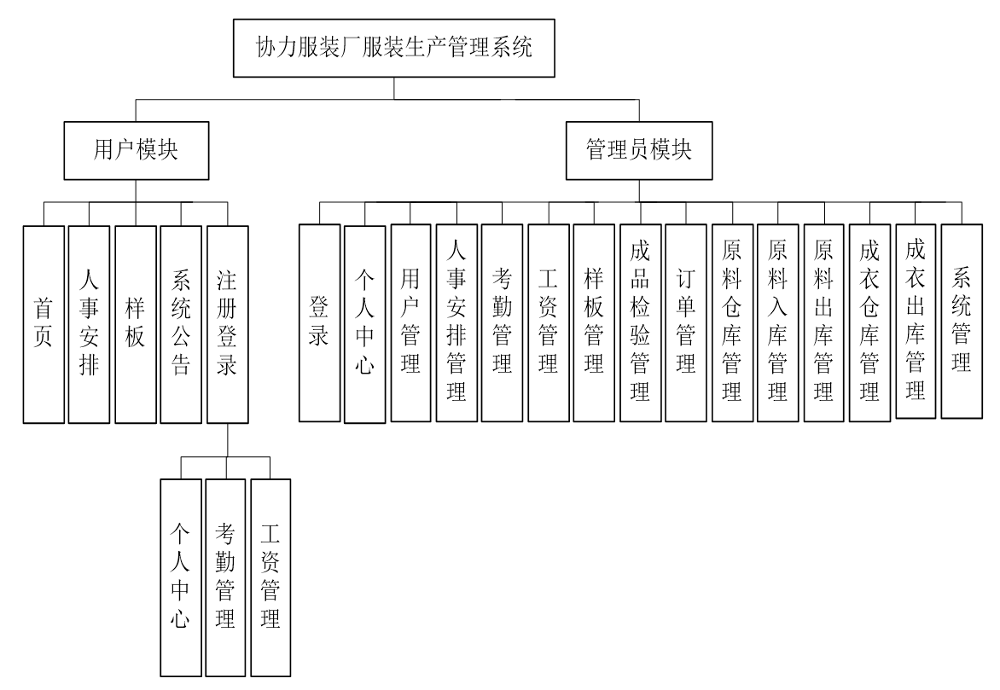
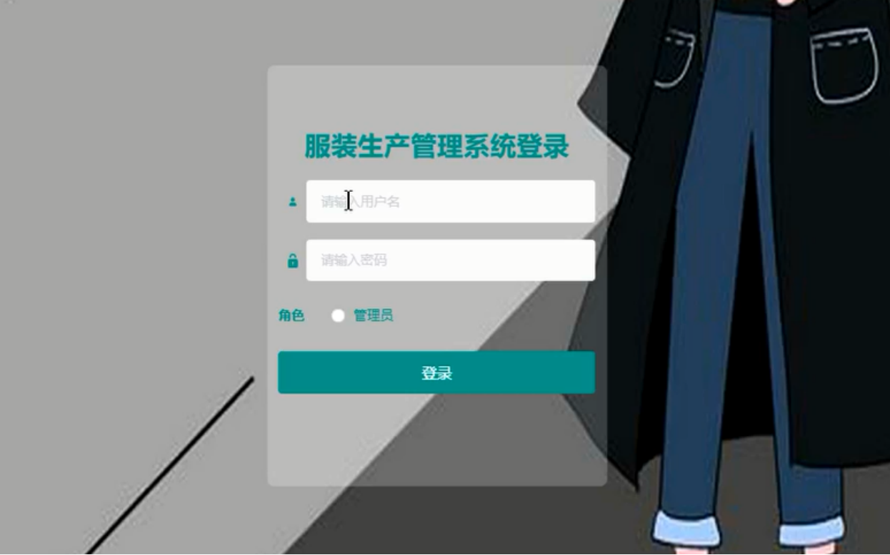
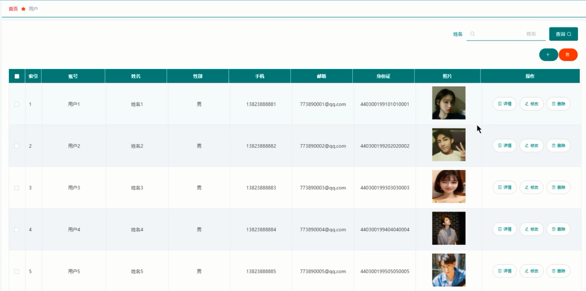
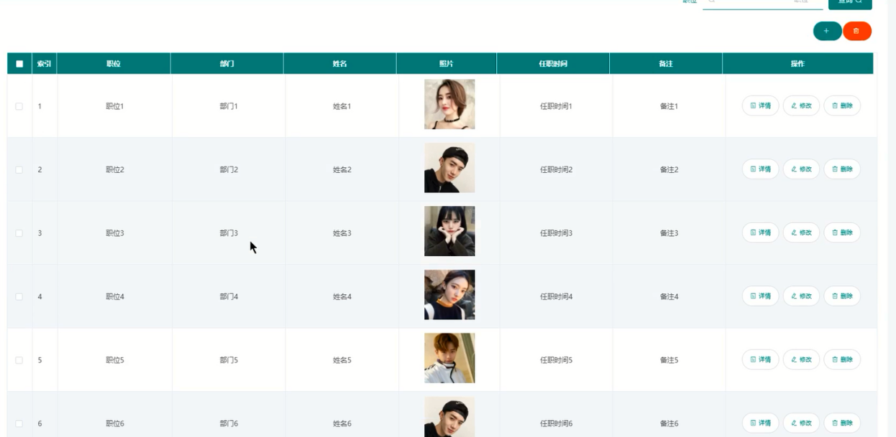
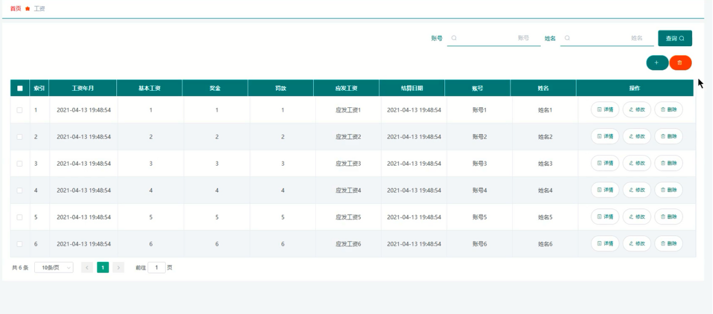
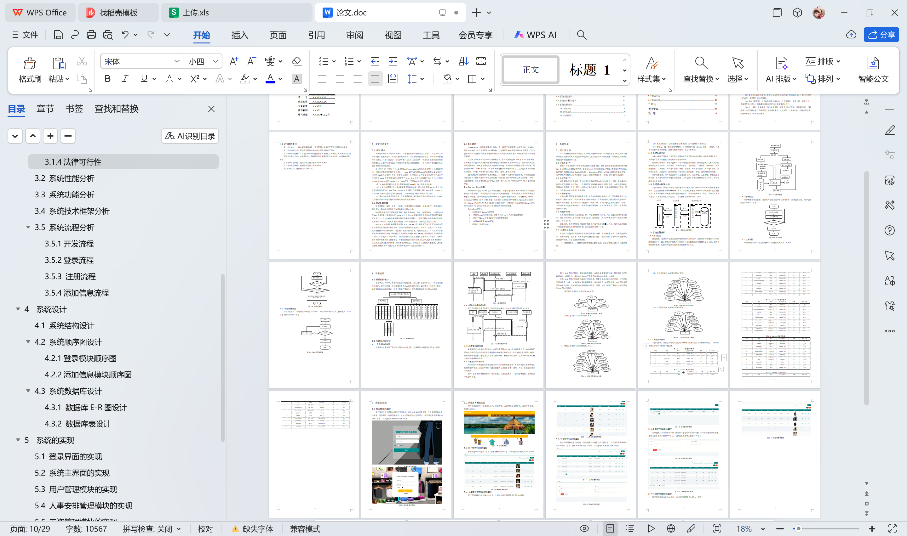

# springboot055-基于SpringBoot的服装生产管理的设计与实现

>  博主介绍：
>  Hey，我是程序员Chaers，一个专注于计算机领域的程序员
>  十年大厂程序员全栈开发‍ 日常分享项目经验 解决技术难题与技术推荐 承接各类网站设计，小程序开发，毕设等。
>  【计算机专业课程设计，毕业设计项目，Java，微信小程序，安卓APP都可以做，不仅仅是计算机专业，其它专业都可以】

## 本项目获取地址：https://www.bishecode.com/product/52/

## 3000套系统可挑选，获取链接：https://www.bishecode.com/

### 系统架构

> 前端：html | js | css | jquery | vue
>
> 后端：springboot | mybatis
> 
> 环境：jdk1.8+ | mysql | maven

# 一、内容包括
包括有  项目源码+项目论文+数据库源码+答辩ppt+远程调试成功

# 二、运行环境

> jdk版本：1.8 及以上； ide工具：IDEA； 数据库: mysql5.7及以上；编程语言: Java

# 三、需求分析

**3.1 可行性分析**

可行性分析是该平台系统进行投入开发的基础第一步，必须对其进行可行性分析才能够降低不必要的需要从而使资源合理利用，更具有性价比和降低成本，同时也是系统平台的成功的未雨绸缪的一步。

**3.1.1 技术可行性**

技术可行性是指学习的技术是否能够完成本项目，如果团队本身没有相关的技术储备，而又能够迅速掌握此类技术，那项目应该达不到我们的设计要求。本文将开发的系统，将采用的关键技术包括JAVA编程语言、Spring Boot框架、MYSQL数据库存储技术等。大学时将这些技术已经学习掌握，因此，就技术层面而言，该项目的开发是有保障的。

**3.1.2 经济可行性**

项目需要考虑花费问题，我们必须考虑系统开发中所有的花费进行计算，我们要考虑到系统需不需要太大的资金。二是系统开发后期维护相关的费用大不大。本系统采用我们开源的技术没进行设计，再设计中没有太多的花费，只需要一台电脑便可以进行开发，因此，该项目的实施在经济上完全可行。

**3.1.3 操作可行性**
本系统操作不复杂且比较容易上手，对于初次接触本系统的来说，不许要接受什么培训就可以操作本系统。用户不需要什么特定的软件，只需要安装大众所使用的浏览器即可进行系统的访问。本系统采用可视化窗口，面向大众，有效的避免了繁琐的操作。而且，本系统将各个功能都详细设计，各模块功能逻辑清晰，对用户非常友好。因此，本系统具有操作可行性。

**3.1.4法律可行性**

所有的功能模块都不违法法律，也不涉及法律的灰色地带，项目部署在国内的服务器中，域名在国家的工业和信息化部进行备案，接受监管。所以在开发过程中不会涉及法律责任，具有可行性；
综上所述，本次开发的协力服装厂服装生产管理系统在技术、经济、操作以及法律四个方面都能够保障系统的顺利开发，具有极高的开发可行性。

**3.2 系统性能分析**

系统除了功能结构设计以外还需要附加需求的分析，非功能需求分析，主要是包括界面、数据库问题、框架等，需要满足非功能性能的需求，保证系统运行起来的时候能够达到最佳的效果，保证稳定性和安全性。

（1）数据底层统一。数据传输中需要进行数据处理，在查询数据存储上达到最佳效果。

（2）界面风格统一。图片需要进行PS处理，文字需要统一格式大小。

（3）数据库。每个模块都需要独立，各个模块之间相互配合，形成一个整体，包装各个功能合理化的配置，需要考虑开放端口，满足可扩展性。

**3.3 系统功能分析**

本协力服装厂服装生产管理系统主要实现了管理员功能模和用户功能模块两大部分，下面将对这两大功能模块分别进行功能需求分析。
管理员功能模块：管理员登录后可对系统进行全面管理，管理员登录后主要实现的功能模块包括个人中心、用户管理、人事安排管理、考勤管理、工资管理、样板管理、成品检验管理、订单管理、原料仓库管理、原料入库管理、原料出库管理、成衣仓库管理、成衣出库管理、系统管理，管理员实现了对系统信息的查看、添加、修改和删除的功能。
用户功能模块：用户在系统前台可查看系统信息，包括首页、人事安排、样板以及系统公告，没有账号的用户可进行注册操作，注册登录后主要功能模块包个人中心、考勤管理以及工资管理。

# 四、功能模块

在结构设计过程中，首先对系统进行需求分析，然后进行系统初步设计，将系统功能模块细化，具体分析每一个功能模块具体应该首先哪些功能，最后将各个模块进行整合，实现系统结构的最终设计。本协力服装厂服装生产管理系统结构设计如图

# 五、效果图展示【部分效果图】

图5-1  管理员登录界面图【用户要想进入本系统必须进行登录操作，进入对应角色登录界面，在登录界面输入系统账号、登录密码，选择登录类型，点击登录按钮进行登录系统，管理员登录界面展示如图】

图5-2用户登录界面图【用户登录界面展示如图】

图5-3 系统主界面图【用户在系统前台可查看系统信息，包括首页、人事安排以及样板等，系统主界面展示如图】

图5-4 用户管理界面图【管理员登录后可查询、添加、修改和删除用户信息，用户管理界面展示如图】

图5-5  人事安排管理界面图【管理员可增删改查人事安排信息，人事安排管理界面展示如图】

图5-6  工资管理界面图【管理员可增删改查工资信息，用户登录后可查看个人工资信息，工资管理界面展示如图】

 <b>完整文章</b>

 

## 本项目获取地址：https://www.bishecode.com/product/52/

## 3000套系统可挑选，获取链接：https://www.bishecode.com/

